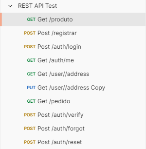
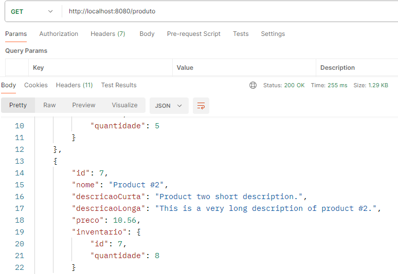
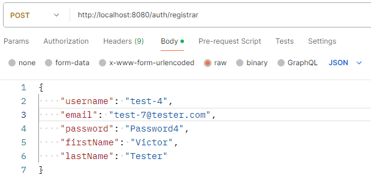
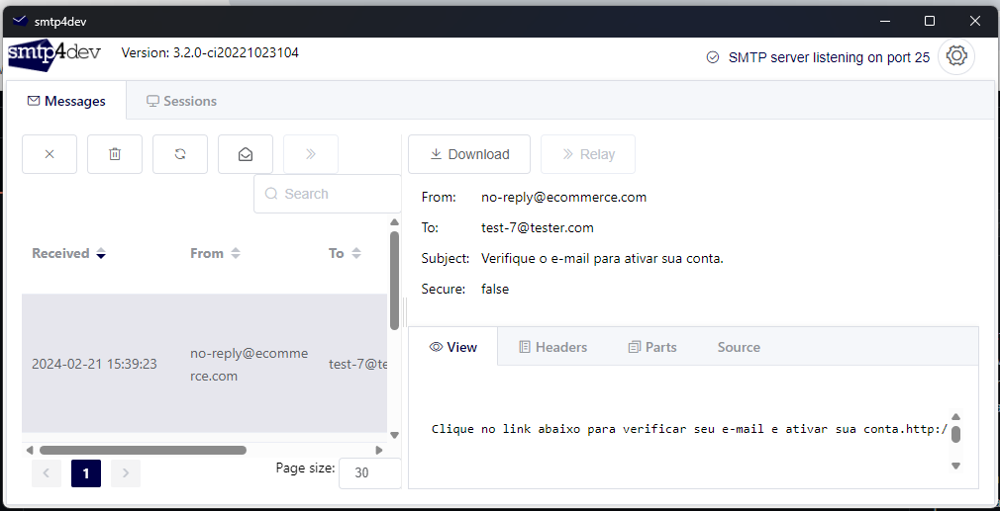
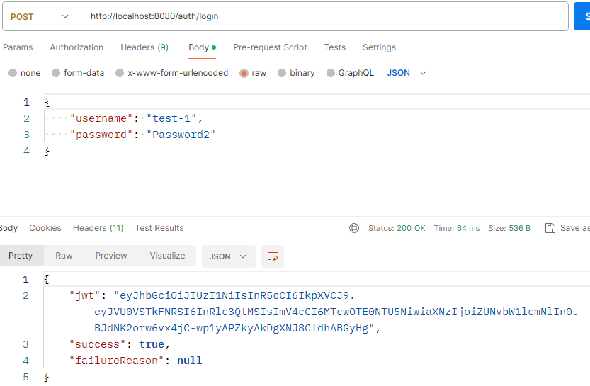

# ecommerce-backend

Ecommerce-backend é uma aplicação desenvolvida utilizando Spring boot framework. Esse projeto foi feito com o objetivo aprofundar meu conhecimento em spring api, spring security, JPA e JUnit. Essa aplicação JWT token como forma de autenticação.
## Features

- Listagem de produtos.
- Registro e Login de usuários.
- Verificação de email.
- Reculperação de senha via email.
- Atualização e adição de endereços.
## Aprendizados

- Estrutura de projeto Spring RestAPI
- Padrão de Camadas
- Controller, service, repository
- Padrão DTO
- Entidades e ORM
- Consultas SQL no Spring Data JPA
- Autenticação com JWT Token
- Verificação de email
- Encriptação de senhas
- smtp4dev
## Screenshots






## Deploy

Para fazer o deploy desse projeto rode

```bash
# clonar repositório
git clone git@github.com:ViictorP/ecommerce-backend.git

# entrar na pasta do projeto
cd ecommerce-backend

# executar o projeto
./mvnw spring-boot:run
```
## Referência

 - [Backslash Programming](https://www.youtube.com/playlist?list=PLtBt-olBU9cTm-5SdTy3mjaSEnHglK-Mz)